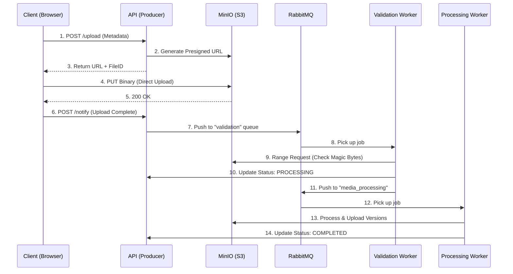

# Conveyor: High-Volume Media Processing Pipeline

**Conveyor** is a production-grade, event-driven media processing pipeline designed to handle massive file uploads with zero server-side bottlenecks. It leverages **Direct-to-Storage** uploads and a multi-stage **RabbitMQ** orchestration to ensure scalability, reliability, and security.

## Architecture Overview

The system is built on a "Middleman-Bypass" architecture. Instead of streaming heavy media bytes through a Node.js API, the API acts as a traffic controller, delegating the heavy lifting to MinIO and dedicated workers.



## Key Technical Features

### 1. Direct-to-Storage (Zero-Bandwidth API)
By using **AWS S3 Presigned URLs**, clients stream binaries directly to MinIO. This prevents the Node.js event loop from being blocked by heavy I/O and saves 100% of the server's network bandwidth.

### 2. Multi-Stage "Conveyor Belt"
The pipeline is divided into specialized workers:
- **Validation Worker**: Performs a high-performance **S3 Range Request** to download only the first 4KB of a file. It uses `file-type` to verify "Magic Bytes" against user-claimed metadata, preventing malicious or corrupted uploads at the gate.
- **Media Processing Worker**: Uses `sharp` (High-performance C++ lib) to generate thumbnails and optimized web versions in parallel.

### 3. Asynchronous Reliability
- **RabbitMQ Acknowledgment (ACK)**: Jobs are only removed from the queue once a worker successfully finishes. If a worker crashes, the job is re-queued, ensuring no media is lost.
- Workers live in a dedicated `/workers` directory, allowing them to be scaled independently (e.g., 1 API vs 50 Workers).

## Tech Stack
- **Backend**: Node.js, Express, TypeScript
- **Storage**: MinIO (S3 Compatible)
- **Database**: MongoDB (Mongoose)
- **Messaging**: RabbitMQ
- **Image Engine**: Sharp
- **Validation**: file-type (Magic Byte analysis)

## Getting Started

### Prerequisites
- [pnpm](https://pnpm.io/)
- [Docker & Docker Compose](https://www.docker.com/)

### 1. Infrastructure Setup
Spin up the core services using Docker:
```bash
docker compose up -d
```
This starts:
- **MinIO**: `http://localhost:9000` (API) & `http://localhost:9001` (Console)
- **RabbitMQ**: `http://localhost:15672` (Management UI - User: `user`, Pass: `password`)
- **MongoDB**: The primary data store for file records.

### 2. Installation
```bash
pnpm install
```

### 3. Environment Configuration
Create a `.env` file in the root:
```env
DB_URL=mongodb://localhost:27017/conveyor
MIN_IO_URL=http://localhost:9000
MINIO_ACCESS_KEY=minio-user
MINIO_SECRET_KEY=minio-password
RABBITMQ_USER=user
RABBITMQ_PASSWORD=password
```

### 4. Running the Pipeline
You need to run the API and the workers in separate terminals:

**Terminal 1 (The API):**
```bash
pnpm start
```

**Terminal 2 (The Validator):**
```bash
npx ts-node workers/validation.ts
```

**Terminal 3 (The Processor):**
```bash
npx ts-node workers/processing.ts
```

## Simulation
Open the `public/index.html` file in your browser. You can select an image, watch the real-time progress bar (streaming direct to MinIO), and monitor the terminals to see the job being handed off between workers.

## Stress Testing

Validate the pipeline's performance under load and generate resume-worthy metrics:

**Quick Test** (2 minutes, recommended for first-time testing):
```bash
pnpm test:quick
```

**Full Stress Test** (5 minutes, 200 concurrent users):
```bash
pnpm test:stress
```

**Worker Throughput Benchmark**:
```bash
pnpm test:worker
```

**What You'll Get:**
- Throughput metrics (requests/second, messages/second)
- Latency distribution (P50, P95, P99, Max)
- Success rates and failure analysis
- Resume-ready performance bullet points

For detailed testing documentation and interpreting results, see [STRESS_TESTING.md](STRESS_TESTING.md).


##  Roadmap
- [x] S3 Direct-to-Storage Integration
- [x] RabbitMQ Multi-stage Orchestration
- [x] Magic Byte Validation (Range Requests)
- [x] High-performance Image Processing (Sharp)
- [ ] Video Transcoding Implementation (FFmpeg)
- [ ] Webhook notifications for client-side updates

---
*Developed for high-volume, scalable media architectures.*
